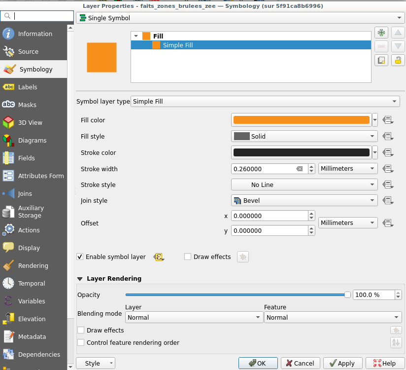

# Introduction 
Le projet de production de fiche communale est réalisé à partir de QGIS et de ses fonctionnalités d'atlas. Une fiche pour chaque commune de Nouvelle-caléodnie est éditée, elle présente un ensemble d'indicateur sur la pression incendie à l'échelle communale et met en perspective sur l'ensemble du territoire et sur l'historique des détéctions d'incendies. 

# Guide de démarage

## Docker
Un fichier compose permet de déployer facillement une instance de QGIS.


Sous linux, pour démarrer l'application qgis utilisez cette commande 

```
xhost +local:docker 
docker exec -itd qgis-dev qgis 
```
ou créer un fichier .sh et un lanceur (remplacer mdpsudo avec le mot de passe sudo)

```
#!/bin/bash
echo [mdpsudo] | sudo -S xhost +local:docker 
sudo -S docker exec -itd qgis-dev qgis 
``` 

## QGIS project

Le projet qgs contient la mise en page, les styles, les accès aux données (localisées en base de donnée) et les parametres pour faire fonctionner l'atlas.
le fichier de projet contient actuelement les accès à la base de donnée de hugo.  [TODO] : rendre les accès propre à l'application. 

## Pré-requis 

Pour fonctionner Qgis doit avoir le plugin DataPlotly d'installé (sinon QGIS supprimera purement et simplement les widgets plotly du layout), des fonts et des icons.


### Installation de DataPlotly 
L'installation se fait par le gestionnaire d'extention de QGIS.
Le module DataPlotly a besoin de 2 dépendances : Pandas et Plotly
Pour installer ces 2 dépendances il faut lancer la commande pip correspondante :
`
pip install pandas plotly 
`
Une variable d'environnement ATLAS_YEAR doit être renseignée pour générer une fiche pour une année en particulier. 
Pour cela, QGIS permet de surcharger la variable :
- settings > options > System > environnement
Cocher "Use custom variables"
Ajouter un variable si elle n'existe pas encore ou modifier la valeur par l'année que vous souhaitez traiter.
Redemarer QGIS

### Fonts et icons svg
Des fonts spécifiques sont utilisées dans les fiches. ils doivent être présent dans les dossiers correspondant :

voici la commande à utilisée si vos sources sont dans /root/fonts et /root/resources/
```
cp  /root/fonts/ArialNova/* /root/.local/share/QGIS/QGIS3/profiles/default/fonts/
cp  /root/fonts/cerebri-sans/* /root/.local/share/QGIS/QGIS3/profiles/default/fonts/
mkdir /usr/share/qgis/svg/oeil_atlas_communal
cp /root/resources/* /usr/share/qgis/svg/oeil_atlas_communal/
```


# Générer un atlas de fiches communales
- Démarrer QGIS
- Ouvrir le projet
- Ouvrir le layout "fiche_commune_incendie"
- Lancer la génération de l'atlas en mode Image et en JPG en 400 dpi avec antialisasing (permet d'avoir des fiches propres de tailles relativement réduites 1 à 2 mo).
- Choisir le dossier d'export pour les fiches.

Les fichiers générés sont nommés selon le patern suivant :
[$ATLAS_YEAR]_[libelle_commune]_[n°_fiche]_[n°_page]
Soit en language QGIS  : 
`concat(env('ATLAS_YEAR'),'_',libelle)||'_'||@atlas_featurenumber`

# Développement de la fiche
## Paramètre d'atlas : Couche de couverture de l'atlas
La couche qui pilote l'atlas provient de la vue "atlas_commune_id_sptaial_simplifiee". Elle pilote à la fois l'affichage et filtre des données de la carte et l'affichage/filtre des données de texte dynamiques et des graphiques. 
Le nom de la page est `id_spatial` ce qui permet d'avoir une vvariable dynamique disponible dans chaque widget, qui changera pour chaque commune. La varible est accessible à partir de @atlas_pagename.
On définit ici le format d'export des images en jpeg.


## Paramètres des valeurs dynamiques
### Widget texte dynamique simple

#### Injection des valeurs dynamiques ou le résultat d'une expression dans un élements texte 


Le resultat de l'expression QGIS peut être injectée dans un objet texte de la mise en page grace à cette syntaxe  `[% "expression ou valeur dynamique injectée" %]`.

Ce qui donne pour injecté la variable d'environnement dans un texte ceci :

```
L'année [% env('ATLAS_YEAR') %] c'est :
```


#### Filtrer les valeurs dynamiques dans un élements texte
Nous affichons de manière dynamique les valeurs issue de table de fait thématique.
Les tables de faits thématiques sont filtrées selon les dimensions spatiales et temporelles 
Le filtre des données selon l'année se fait grâce à la variable d'environnement `ATLAS_YEAR`.
Le filtre des données sur la dimension spatiale se fait grace à l' `id_spatial` disponible dans la couche de couverture de l'atlas `@atlas_pagename` et dans toutes les tables de fait des thématiques.

Cela se traduit en QGIS par l'expression de filtre suivante: 
`id_spatial = @atlas_pagename and annee = env('ATLAS_YEAR')`


Les données affichées ne sont pas issue de la couche de couverture de l'atlas, mais des tables de faits thématiques. Pour pouvoir afficher ces données, nous utilisons la fonction QGIS `aggregate`, permettant d'acceder à d'autre données du projet et d'appliquer une expression une régle d'aggregation et un filtre.

Par exemple , nous souhaitons afficher les zones brulées dans un perimètre administratif, nous utilisons la table/vue `vue_dtm_zb_administ_nobyindex` nous faisons la somme des valeur (`sum` de l'attribut `superficie_indic_ha` en filtrant sur 
`id_spatial = @atlas_pagename `. Il est aussi possible d'ajouter dans le filtre `type_spatial = 'commune'` si besoin.
)

``` python

aggregate(
        layer :='vue_dtm_zb_administ_nobyindex',
        aggregate := 'sum',
        expression := "superficie_indic_ha",
        filter :=  type_spatial = 'commune'  and id_spatial = @atlas_pagename 
        )

```


### Widget avec affichage multiple et conditionnel
#### Texte au pluriel / singulier

Selon les cas où les valeurs dynamiques peuvent impliquer des règles de grammaire et d'orthographe particulière, il est possible d'utiliser plusieurs expression utilisant `if` conjointement avec l'aggregation vue plus haut. 

Ce qui donne en QGIS ceci :

```
[%if(
    to_int(aggregate(
        layer :='vue_dtm_zb_administ_nobyindex',
        aggregate := 'sum',
        expression := "nb_indic",
        filter := type_spatial = 'commune' and id_spatial  = @atlas_pagename  and env('ATLAS_YEAR') = annee
        ))
    is NULL, '0', to_int(aggregate(
        layer :='vue_dtm_zb_administ_nobyindex',
        aggregate := 'sum',
        expression := "nb_indic",
        filter :=  type_spatial = 'commune'  and id_spatial = @atlas_pagename  and env('ATLAS_YEAR') = annee
        )) 
    )
%] [% 
if(
    to_int(aggregate(
        layer :='vue_dtm_zb_administ_nobyindex',
        aggregate := 'sum',
        expression := "nb_indic",
        filter :=  type_spatial = 'commune'  and id_spatial = @atlas_pagename  and env('ATLAS_YEAR') = annee
    )) >1,
    'incendies détectés','incendie détecté'
    )
%]
```
Dans le cas ci-dessus, on test si la somme des valeurs de nb_indic est NULL. Si oui on insère la valeur '0' sinon on insère la somme des valeurs nb_indic. 
On insère ensuite une seconde expression (après avoir mis un espace), qui tests si la valeur de la somme est supérieur à 1. Si oui le texte `incendies détectés` sera sinon il sera `incendie détecté`.


#### Elements de remplacement avec HTML

L'objet du layout utilisé ici est l'objet HTML. Nous pouvons inserer un code source HTML ou importer le résultat d'une requette http sur une url.   

L'objet HTML permet d'utiliser une stylsheet particulière (case à cocher).

La stylsheet CSS utilisée est pour notre cas est :

```css
body { 
	margin: 0 0;
	font-family: Arial Nova;
	font-style: normal;
	font-weight: 300;
	font-size: 14.6991px;
	color: rgba(0,0,0,1.0000);
	text-align: justify; }


ul {
  columns: 1;
  -webkit-columns: 1;
  -moz-columns: 1;
}
li{
 list-style-type: none;
font-family: "Arial Nova";
font-size: 11px;
text-align: center;
margin: 0px 0px 0px 0px;
}

.small img{
	width: 270px;
	max-height: 360px
}
.big img{
	width: 270px;
	height: 600px;
    padding: -10px -10px -10px -10px;

}

```


Le langage d'expression de QGIS permet de gérer des cas multiples et complexes grace à cette syntaxe :

``` python
CASE 
WHEN
THEN
END
```

Aussi, afin de pouvoir afficher ou non des images par dessus du contenu dynamique, l'utilisation d'un rendu HTML va permettre d'injecter des images selon des règles de style CSS.

Le code est globlalement similaire au précédent mais légèrement plus compact que si nous avions utilisé la syntaxe `if`.
Aussi le codes HTML injecté conditionnelement utilise des classes CSS dédiées permettant d'afficher les mêmes ressources de manière différente selon le contexte défini par l'expresion `CASE WHEN` de QGIS.

``` python
[%CASE 
WHEN  
aggregate( 
 layer:='vue_dtm_zb_perimetres_protection_eau_byindex',
 aggregate := 'sum',
 expression := "superficie_indic_ha"
 ,
 filter := id_spatial =  @atlas_pagename and type_spatial = 'commune' 
) = 0 AND 
aggregate( 
 layer:='vue_dtm_zb_surfaces_agricoles_byindex',
 aggregate := 'sum',
 expression := "superficie_indic_ha"
 ,
 filter := id_spatial =  @atlas_pagename and type_spatial = 'commune'
) > 0.01
THEN 
'<div class=small>
    
</div>'
WHEN  
aggregate( 
 layer:='vue_dtm_zb_perimetres_protection_eau_byindex',
 aggregate := 'sum',
 expression := "superficie_indic_ha"
 ,
 filter :=  id_spatial =  @atlas_pagename and type_spatial = 'commune' and annee = env('ATLAS_YEAR')
) = 0 AND 
aggregate( 
 layer:='vue_dtm_zb_surfaces_agricoles_byindex',
 aggregate := 'sum',
 expression := "superficie_indic_ha"
 ,
 filter :=  id_spatial =  @atlas_pagename and type_spatial = 'commune' and annee = env('ATLAS_YEAR')
) = 0
THEN 
'<div class=big>
    
</div>'

WHEN  
aggregate( 
 layer:='vue_dtm_zb_perimetres_protection_eau_byindex',
 aggregate := 'sum',
 expression := "superficie_indic_ha"
 ,
 filter :=  id_spatial =  @atlas_pagename and type_spatial = 'commune' and annee = env('ATLAS_YEAR')
) = 0 AND 
aggregate( 
 layer:='vue_dtm_zb_surfaces_agricoles_byindex',
 aggregate := 'sum',
 expression := "superficie_indic_ha"
 ,
 filter :=  id_spatial =  @atlas_pagename and type_spatial = 'commune' and annee = env('ATLAS_YEAR')
) < 0.01  
THEN 
'<div class=big>
    
</div>'

END%]
```


### Widget de carte
#### Filtrer des données affichées sur la carte
Les données affichées sur la carte sont filtrées à partir des règles de style.
Dans la sous section du style des objet (remplissage), il faut activer l'option de symbol layer et éditer l'expression :
`id_spatial = @atlas_pagename and annee = env('ATLAS_YEAR')`




#### Affichage de l'entité géographique d'interêt (masque inversé)

La couche de couverture de l'atlas a un style particulier permettant d'inverser l'affichage tel un masque (invertedPolygonRenderer) permettant de rendre "flou" ce qui est en dehord de la zone d'interet géographique (entités de la couverture de l'atlas).
L'expression utilisée dans le style est simplement :
`id_spatial = @atlas_pagename`

### Widget DataPlotly

L'utilisation du plugin permet de simplifier la démarche de valorisation des graphiques, mais ces graphiques sont parfois aussi limités en terme de fonctionnalités.
#### Expression et filtres sur les données
éditer le feature subset afin d'exploiter que les données de la zone d'étude sur l'année d'étude. Pour cela on utilise comme pour les autres objets la même expression :
`id_spatial = @atlas_pagename and annee = env('ATLAS_YEAR')`


#### Style et rendu des graphiques
Les graphiques peut être un peu customisées dans les propriétés du Plot. 
Dans la section Title and labels customization, les ticks et titres d'axes sont masqués ou non grace au choix des couleurs de font (masqué = blanc).

Ajout d'un label (hover) : 
Dans certain cas on affiche une valeur sur le graphique, parfois avec une expression permettant de gérer des conditions `if`.
Par exemple : 
`concat(to_int("superficie_indic_ha" ), if(to_int("superficie_indic_ha") > 1,'  ha brûlés','  ha brûlé'))` ,
permet de gérer le plusiel et d'arrondir à l'inférieur la valeur de superficie_indic_ha


#### Des plots composites multiples complexes 
Attention, le plugin est un peu capricieu et peu modifer les propriétés d'un plot composite , même lorsque vous naviguez simplement dans les options. N'enregistrer pas vos modifications.

L'utilisation des mode de représentation vont permettre de supperposer deux représentations de données différentes sur le même graphique (Hover / stack / group).


#### Mapping des légendes / couleurs
 
Dans les propriété d'un plot, les textes de légende et la couleur peuvent être obtenu par expression. Plotly récupère et map les données avec des couleurs grace a sa fonction map_get.

```python 
map_get(
map(
'Strate arborée','#4C7304',
 'Strate arbustive' ,'#92A45A',
 'Strate herbacée' ,'#98E60E'
),"l_2014_n3"
)
```

l_2014_n3 est l'attribut de classe et on retrouve dans la fonction map, les valeurs et les couleurs Hexadecimales à afficher.